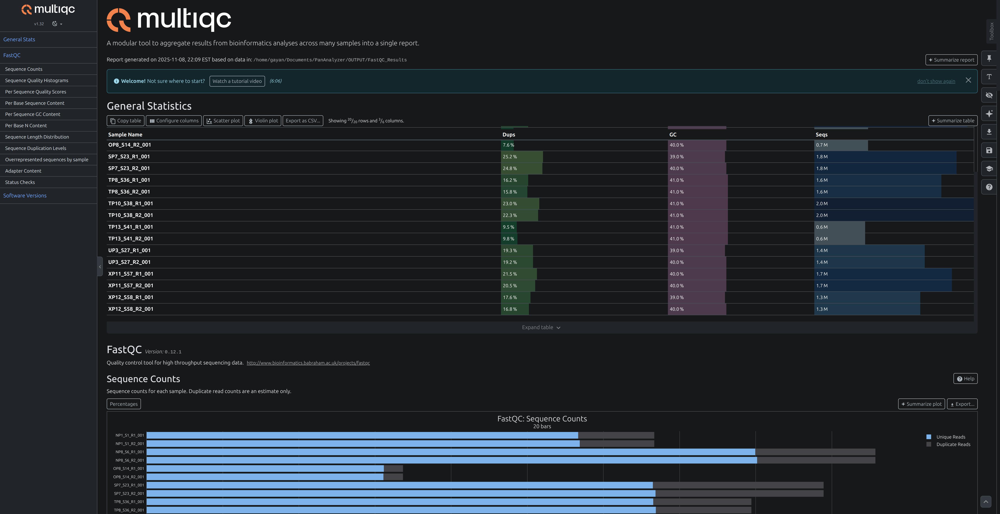
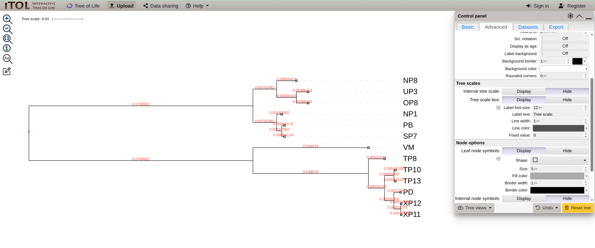

# PanAnalyzer: A Comprehensive Genome Analysis Pipeline

**PanAnalyzer** is a powerful and integrated bioinformatics pipeline designed to streamline the process of genome analysis, moving from raw sequencing data to sophisticated, interactive pangenome visualization. By leveraging a curated set of industry-standard tools—**FastQC**, **SPAdes**, and **Anvio 8**—this pipeline provides an end-to-end solution for researchers in microbial genomics, evolutionary biology, and comparative genomics. The primary goal of PanAnalyzer is to automate the critical steps of quality control, assembly, and pangenome characterization, enabling researchers to efficiently analyze multiple genomes and uncover the core, accessory, and unique gene repertoires of their target species.

## 1. Initial Data Processing and Quality Control

The pipeline's workflow begins with the essential step of quality assessment. All incoming raw sequencing read files (typically in `.fastq` format) are first processed by **FastQC**. This tool generates comprehensive diagnostic reports for each sample, meticulously evaluating key metrics such as per-base quality scores, GC content, sequence duplication levels, and the presence of overrepresented sequences or adapter contamination.

These reports are critical for identifying potential issues with the sequencing data. Informed by the FastQC output, PanAnalyzer then proceeds to a rigorous pre-processing and filtering stage (often using tools like Trimmomatic or fastp) to remove low-quality bases, trim adapters, and filter out reads that do not meet quality thresholds. This refinement is essential for ensuring that only high-quality, reliable data is passed on to the assembly stage, significantly improving the accuracy and contiguity of the resulting genome.

## 2. High-Performance De Novo Genome Assembly

Once the reads are cleaned, the high-quality data is fed into **SPAdes**, a high-performance _de novo_ genome assembler. SPAdes is chosen for its robustness and its sophisticated de Bruijn graph-based algorithms, which are adept at handling various sequencing data types, including Illumina short reads, and are particularly effective for bacterial and archaeal genomes. It carefully navigates repeats and coverage variations to reconstruct the most plausible genomic sequence from the short-read data. The primary output of this stage is a `contigs.fasta` file for each sample, which represents the draft genome assembly for that organism.

## 3. Pangenome Construction and Visualization

With the draft genomes assembled, PanAnalyzer transitions from single-genome reconstruction to multi-genome comparative analysis using the **Anvio 8** platform. This is the core of the pangenome analysis.

First, each assembled `contigs.fasta` file is converted into an Anvio-specific contigs database. During this process, Anvio identifies open reading frames (ORFs), annotates genes using functions like NCBI COGs (Clusters of Orthologous Groups), and identifies ribosomal RNAs and key single-copy core genes.

Once all genomes are processed, the `anvi-pan-genome` workflow is executed. This powerful command clusters all identified genes from all input genomes to build a comprehensive pangenome database. It systematically identifies the **core genome** (gene clusters present in all strains), the **accessory genome** (gene clusters present in some strains), and **unique genes** (specific to a single strain).

The true power of PanAnalyzer is realized in the final visualization. Anvio's interactive display allows researchers to visually explore the entire pangenome, integrating genome structure, gene cluster presence/absence, functional annotations, and phylogenetic relationships into a single, dynamic and publication-quality interface. This enables the intuitive discovery of genomic islands, functional differentiators between strains, and the core evolutionary history of the species.

## The Pipeline Diagram


## Environment Setup

### Conda Setup (Optional)

Below are the steps to set up using Conda environment manager on Linux (Debian based). Skip if you already have Conda installed in your system.

```bash
# Create a folder in the user's home directory.
mkdir -p ~/miniconda3

# Download Miniconda (Miniconda is a reduced package and helps you save disk space.)
wget https://repo.anaconda.com/miniconda/Miniconda3-latest-Linux-x86_64.sh -O ~/miniconda3/miniconda.sh

# Set up Conda
bash ~/miniconda3/miniconda.sh -b -u -p ~/miniconda3

# Remove setup files.
rm ~/miniconda3/miniconda.sh

# Add Conda path to the .bashrc file.
nano ~/.bashrc # Insert at bottom of the file -> export PATH="~/miniconda3/condabin:$PATH"

# Close terminal and reopen a new terminal to refresh.
# Initialize Conda
conda init
```

### Conda Environment Setup

First check the Conda version and run an update. This command will update the Conda environment if updates are available.

```bash
conda --version  # -> conda 23.7.4

# Update Conda if needed
conda update conda
```

You need to create a new Conda environment for the PanAnalyzer pipeline. I named the Conda environment "GEM".

```bash
# Create new Conda environment called "GEM"
conda create -n GEM python=3.10

# Activate the newly created Conda environment.
conda activate GEM

# Upgrade PIP in the environment if needed.
python -m pip install --upgrade pip
```

If you need to remove the environment.

```bash
# Deactivate Conda environment -> (GEM) user_name@pc_name$ _ to (base) user_name@pc_name$ _ or user_name@pc_name$ _.
conda deactivate

# In case you need to delete the environment (for recreation if something is not working).
conda env remove -n GEM
```

### Install Anvio

Please select the Linux setup instructions. You can directly install Anvio 8 from the command below. Please check that the updated command is available on [Anvio's website](https://anvio.org/install/linux/stable/) for version compatibility.

```bash
# Activate Conda environment (previously created)
conda activate GEM  # If Conda environment is not already activated.

# Set up required packages
conda install -y -c conda-forge -c bioconda python=3.10 \
    sqlite=3.46 prodigal idba mcl muscle=3.8.1551 famsa hmmer diamond \
    blast megahit spades bowtie2 bwa graphviz "samtools>=1.9" \
    trimal iqtree trnascan-se fasttree vmatch r-base r-tidyverse \
    r-optparse r-stringi r-magrittr bioconductor-qvalue meme ghostscript \
    nodejs=20.12.2

# Download precompiled binaries of Anvio package from GitHub.
curl -L https://github.com/merenlab/anvio/releases/download/v8/anvio-8.tar.gz --output anvio-8.tar.gz

# Set up downloaded package using pip.
pip install anvio-8.tar.gz

# Remove downloaded setup file.
rm anvio-8.tar.gz
```

NOTE: Please check Anvio's website for updated installation instructions.

### Install FastQC

FastQC aims to provide a simple way to do some quality control checks on raw sequence data coming from high throughput sequencing pipelines.

```bash
# Activate Conda environment
conda activate GEM  # If Conda environment is not already activated.

# Install FastQC from BioConda channel
conda install -c bioconda fastqc

# Install MultiQC for combining FastQC reports using pip.
pip install multiqc
```

### Set Up Anvio Environment

Before running anything, you need to set up the required genome reference databases in the Conda environment.

```bash
# Anvio's ANI process needs a lower version of matplotlib at the time of writing.
pip install matplotlib==3.7.3

# Set up NCBI COGs databases.
anvi-setup-ncbi-cogs --num-threads 8
   #COG version ..................................: COG20
   #COG data source ..............................: The anvi'o default.
   #COG base directory ...........................: /home/gayan/miniconda3/envs/GEM/lib/python3.10/site-packages/anvio/data/misc/COG
   #...

# Download information from GTDB (gtdb.ecogenomic.org).
anvi-setup-scg-taxonomy --num-threads 8
```

### Set Up SPAdes

You can install SPAdes for genome assembly Python application to the currently activated Conda environment.

```bash
# Activate Conda environment
conda activate GEM  # If Conda environment is not already activated.

# Install SPAdes from BioConda channel
conda install -c bioconda spades

# Test SPAdes installation
spades.py --help
spades.py --test --careful && rm -rf spades_test
```

### Setup Prokka

Rapid bacterial genome annotation. Whole genome annotation is the process of identifying features of interest in a set of genomic DNA sequences, and labelling them with useful information. Prokka is a software tool to annotate bacterial, archaeal and viral genomes quickly and produce standards-compliant output files.

```bash
conda deactivate
# Make sure you are on (base) env
conda create -n GEM-ROARY -c conda-forge -c bioconda prokka
conda activate GEM-ROARY
prokka --setupdb
prokka --help
```

### Setup Roray

Roary is a high speed stand alone pan genome pipeline, which takes annotated assemblies in GFF3 format (produced by Prokka (Seemann, 2014)) and calculates the pan genome.

```bash
conda install -c conda-forge -c bioconda roary
roary --help
```

### Setup IQ-TREE 2

IQ-TREE is an excellent and modern choice for Maximum Likelihood phylogeny.

```bash
conda install -c bioconda iqtree
iqtree --help
# In the root folder Roary_Results_<Number> folder generated.
iqtree -s Roary_Results_1762224867/core_gene_alignment.aln -T 8 -m GTR+G -bb 1000
#Analysis results written to: 
   #IQ-TREE report:                Roary_Results_1762224867/core_gene_alignment.aln.iqtree
   #Maximum-likelihood tree:       Roary_Results_1762224867/core_gene_alignment.aln.treefile
   #Likelihood distances:          Roary_Results_1762224867/core_gene_alignment.aln.mldist
   #Screen log file:               Roary_Results_1762224867/core_gene_alignment.aln.log
```

The **core_gene_alignment.aln.treefile** is the Maximum-Likelihood (ML) tree calculated by IQ-TREE and is in the Newick format (or a similar, compatible tree format). This file contains all the necessary branching information and branch lengths to display the evolutionary relationships among your genomes.

The **core_gene_alignment.aln.iqtree** is the verbose report file. It contains detailed information about the model selection, log-likelihood, and other run statistics, but it is not the file for graphical tree display.

Use TreeViewer to Visualize -> <https://github.com/arklumpus/TreeViewer/wiki>  
Use <https://icytree.org/>


## PanAnalyzer Options

Below are the PanAnalyzer options.

```py
# Number of threads and Memory allocation for tools.
THREADS = "8"
MEMORY = "8192"  # in MB

# Path to Conda installation
CONDA_PATH = os.path.expanduser("~/miniconda3/bin/conda")

# Your Conda environment name. (If you use different name during creation of the environment.)
CONDA_ENV = "GEM"

# Sample selection used in the study (see the sample in the project and use as a template).
SAMPLES_PREFIX = "Study-All.csv"  # Name of the study file

# GenBank reference file extensions
REFERENCE_FILE_EXTENSION = ".fna"

# Genome samples postfix of forward and reverse reads.
SAMPLE_FORWARD_READS_POSTFIX = "R1_001.trim.fastq.gz"
SAMPLE_REVERSE_READS_POSTFIX = "R2_001.trim.fastq.gz"

# Name of the project
ANVIO_PROJECT_NAME = "PanAnalyzer"

# You must run the pipeline in this order first: FastQC (optional) -> SPAdes -> Anvio
# If you need to run the SPAdes or Anvio step with different parameters, you can disable the previous or following processed pipeline step(s) that have already run to avoid re-running the entire pipeline or resetting result folders.
PIPE_FASTQC = True
PIPE_SPADES = False
PIPE_ANVI_O = False
```

## How to Run the Pipeline and Visualize Data

**Step 1**:
Add your forward and reverse read samples (`*.fastq.gz`) to the `DATA/Samples` directory. Example pairs include `NP1_S1_R1_001.trim.fastq.gz` (forward) and `NP1_S1_R2_001.trim.fastq.gz` (reverse). Ensure the `NP1` prefix (or equivalent) matches the sample ID recorded in `Study.csv`, and confirm that both forward and reverse reads for every sample are present in the `Samples` folder.

**Step 2**:
Add reference genome(s) from NCBI. GenBank records provide high-quality references; give each reference file a concise name and avoid special characters in both reference and sample filenames.

**Step 3**:
Create `Study.csv` in the `DATA` folder and add your study samples (see the example file on GitHub). Each sample you intend to process must appear in `Study.csv` for the pipeline to include it.

**Step 4**:
The **`pipeline.py`** script is the main entry point. Update the PanAnalyzer options (at the top of `pipeline.py`) to match your system. Make sure the `FastQC_Results`, `SPAdes_Results`, and `Anvio_Results` folders exist inside the `OUTPUT` directory before running the application.

Below is the command to run the pipeline.

```bash
python3 pipeline.py
```

**Step 5**:
To visualize the pangenome with anvi'o's `anvi-display-pan`, supply the paths to `<Project_Name>-GENOMES.db` and `<Project_Name>-PAN.db` (located in the `PAN` subfolder of `OUTPUT/Anvio_Results`). Copy the `OUTPUT` directory to a separate location for long-term storage; a new pipeline run will clear the contents of `OUTPUT`, so keep track of each study's results.

Below is the command to launch the web server and create the anvi'o interactive web interface using the provided **`server.sh`** script.

```bash
chmod +x server.sh  # You need to make the script file executable once.
./server.sh -p ./OUTPUT/Anvio_Results/PAN/PanAnalyzer-PAN.db -g ./OUTPUT/Anvio_Results/PanAnalyzer-GENOMES.db -e GEM -P 8080
```

- Access the server at `http://localhost:8080` (adjust the port if you passed a different value).


- After reviewing the results, stop the running server by pressing `Ctrl+C` in the terminal where it is active.

**Step 6**:
Use the Interactive Tree Of Life (iTOL), an online tool for displaying, annotating, and managing phylogenetic trees. The `*.newick` files are located in `OUTPUT/Anvio_Results/ANI`.

Expected project layout before running the pipeline:

```
PanAnalyzer/
├── DATA/
│   ├── <study>.csv (3 columns CSV file. See the sample)
│   ├── Samples/
│   │   └── <sample fastq.gz files>
│   └── Ref/
│       └── <reference .fna files>
├── OUTPUT/
│   ├── FastQC_Results/
│   ├── SPAdes_Results/
│   └── Anvio_Results/
├── pipeline.py
├── utility.py
└── README.md
```

Run the Python file.

```bash
python3 pipeline.py
```

## Key Tools Used in the **pipeline.py** (Basic form).

### Study Preparation

We need to verify the quality before assembly. We use FastQC for quality checks.

```bash
# Quality check
fastqc --threads 8 --memory 16G NP1_S1_R1_001.trim.fastq.gz NP1_S1_R2_001.trim.fastq.gz
# Create a summary report using MultiQC
multiqc .
```

Look for:

- Per-base quality: most bases > Q30 is ideal.
- Adapter content: should be 0% or near-0%.
- Sequence length distribution: consistent (e.g. 150 bp).
- Paired files: same number of reads (R1 = R2 count).

### How to interpret MultiQC Report (OUTPUT/FastQC_Results/MultiQC_Results):

Below is the sample command to execute the tool.

```bash
fastqc NP1_S1_R1_001.trim.fastq -o FastQC_Results
```

Finally, you can aggregate all reports in the FastQC_Results using:

```bash
multiqc FastQC_Results -o FastQC_Results/MultiQC_Results
```

After the process, aggregated report HTML files will be created in the `FastQC_Results/MultiQC_Results` folder. The HTML file name is `multiqc_report.html`. Double-click to open it in the browser. Use this report to identify bad samples and analyze them more using the individual sample HTML files.

Watch this video for more information:

[](https://www.youtube.com/watch?v=qPbIlO_KWN0)



**Duplicates** = reads with identical sequences appearing multiple times. Can arise from PCR amplification bias or low library complexity. For short-read Illumina data, some duplication (10–20%) is normal, especially with:

- High coverage
- Small genomes
- Targeted sequencing

**GC (GC content)** = proportion of guanine (G) and cytosine (C) bases in the reads. Different organisms have characteristic GC content. Deviations from expected GC content may indicate contamination or biases in library preparation.

- Each organism has a typical GC% (e.g., _E. coli_ ≈ 50%, _Staphylococcus_ ≈ 33%).
- Large deviations from the expected GC% can hint at:
  - Contamination
  - Mixed populations
  - Sequencing artifacts

**Seqs (Sequences)** = total number of reads in the dataset. High read counts generally improve assembly quality and coverage, but excessively high counts may indicate over-sequencing or PCR duplicates.

- More reads = better coverage and assembly quality (generally, aim for millions of reads).
- Excessively high read counts may indicate over-sequencing or PCR duplicates.
- R1 and R2 counts match — excellent! That means no read-pair loss during trimming.

**FastQC Mean Quality Scores** = average quality score across all bases in the reads. Higher scores indicate better base-calling accuracy. Scores above Q30 are considered high quality.

- Mean quality scores above Q30 are excellent.
- Greater than 30 has ≤ 0.1% error rate and the quality is excellent.
- 20-30 has 0.1-0.3% error rate and the quality is good.
- 20-25 has 0.3-1% error rate and the quality is acceptable.
- < 20 has > 1% error rate and the quality is poor.

**Per sequence quality scores** = distribution of average quality scores across all reads. A normal distribution centered around high scores indicates good overall read quality.

- Q > 30 is excellent.
- Q 20-30 is good.
- Q 10-20 is bad.

### SPAdes Assembly

SPAdes is a versatile toolkit designed for assembly and analysis of sequencing data. SPAdes is primarily developed for Illumina sequencing data but can be used for IonTorrent as well. Most SPAdes pipelines support hybrid mode, i.e., allow using long reads (PacBio and Oxford Nanopore) as supplementary data.

The SPAdes package contains assembly pipelines for isolated and single-cell bacterial, as well as metagenomic and transcriptomic data. Additional modes allow discovery of bacterial plasmids and RNA viruses, as well as performing HMM-guided assembly. Besides, the SPAdes package includes supplementary tools for efficient k-mer counting and k-mer-based read filtering, assembly graph construction and simplification, sequence-to-graph alignment, and metagenomic binning refinement.

#### Assemble with SPAdes Sample

```bash
spades.py -1 NP1_S1_R1_001.trim.fastq -2 NP1_S1_R2_001.trim.fastq -o NP1_spades -t 16 -m 64
```

Assembly will be at:

- NP1_spades/contigs.fasta

### Anvi'o Contigs Database Creation

You can download reference files from the National Center for Biotechnology Information (NCBI). Download GenBank only -> Genome sequences (FASTA) ZIP file for the reference. After downloading, you must extract and rename to a simpler name (see the reference samples).

Example: [Veillonella montpellierensis](https://www.ncbi.nlm.nih.gov/datasets/genome/GCF_947090115.1/)

#### Make an Anvi'o contigs database for each sample

```bash
anvi-gen-contigs-database -f NP1_spades/contigs.fasta -o NP1-contigs.db -n "NP1"

# Run HMMs (optional annotations)
anvi-run-hmms -c NP1-contigs.db

# Annotate genes with COGs
anvi-run-ncbi-cogs -c NP1-contigs.db
```

#### Collect individual sample genome databases and add to the genome storage

The `external-genomes.txt` file has the paths to individual `contigs.db` files created by the Anvio process.

```bash
anvi-gen-genomes-storage -e external-genomes.txt -o MY-GENOMES.db
```

#### Add Metadata tp PAN Database and the functional enrichments.

Create a tab separated metadata file. Keep note on column names. The "genome_id" must be in the first column. 

Metadata.txt is:
genome_id phylogroup
NP1 bivia
NP2 bivia
NP4 bivia
NP5 bivia
...

```bash
nvi-import-misc-data -p /home/gayan/Documents/PanAnalyzer/OUTPUT/Anvio_Results/PAN/PanAnalyzer-PAN.db --target-data-table layers /home/gayan/Documents/PanAnalyzer/DATA/Metadata.txt

anvi-compute-functional-enrichment-in-pan -p /home/gayan/Documents/PanAnalyzer/OUTPUT/Anvio_Results/PAN/PanAnalyzer-PAN.db -g /home/gayan/Documents/PanAnalyzer/OUTPUT/Anvio_Results/PanAnalyzer-GENOMES.db -o functional-enrichment-txt --category-variable phylogroup --annotation-source COG20_FUNCTION
```

#### Compute ANI

Compute ANI (Average Nucleotide Identity). This will generate the `*.newick` files to analyze on the [iTOL](https://itol.embl.de) website.

```bash
anvi-compute-genome-similarity --external-genomes external-genomes.txt --program pyANI --output-dir ANI_Results --pan-db MY-PROJECT/MY-PROJECT-PAN.db
```

#### Optional - Adding Phylogenomic Tree to Your Pipeline and you can visualize on iTOL

If you want to generate phylogenomic_tree.nwk, add this step after the pan-genome analysis:

Key Differences

1. ANIb_percentage_identity.newick

   - Method: Genome-level comparison using ANI (Average Nucleotide Identity)
   - Input: Whole genome sequences (nucleotides)
   - Algorithm: pyANI with BLASTN alignment
   - Comparison: Compares entire genome sequences between isolates
   - Use case: Shows overall genomic similarity between strains/isolates

2. The phylogenomic_tree.nwk (from anvi-gen-phylogenomic-tree)
   - Method: Gene-level comparison using concatenated core gene alignments
   - Input: Aligned amino acid sequences from core gene clusters (gene_clusters_aligned.faa)
   - Algorithm: Phylogenetic tree construction (typically IQ-TREE or FastTree)
   - Comparison: Uses only conserved genes shared across all genomes
   - Use case: Shows evolutionary relationships based on core genome

```bash
anvi-get-sequences-for-gene-clusters -p ./OUTPUT/Anvio_Results/PAN/PanAnalyzer-PAN.db \
                                    -g ./OUTPUT/Anvio_Results/PanAnalyzer-GENOMES.db \
                                    --concatenate-gene-clusters \
                                    --max-num-genes-from-each-genome 1 \
                                    --min-num-genomes-gene-cluster-occurs 60 \
                                    -o ./OUTPUT/Anvio_Results/concatenated_alignment.fa

# Test (Only one bootstrap value created)
anvi-gen-phylogenomic-tree -f /home/gayan/Documents/PanAnalyzer/OUTPUT/Anvio_Results/concatenated_alignment.fa \
                           -o /home/gayan/Documents/PanAnalyzer/OUTPUT/Anvio_Results/phylogenomic_tree_with_bootstraps.txt \
                           --program fasttree

iqtree -s ./OUTPUT/Anvio_Results/concatenated_alignment.fa \
      -m TEST \
      -bb 100 \
      -T 8 \
      --prefix ./OUTPUT/Anvio_Results/IQ-TREE_phylogeny
```

##### What this does?

- -s: Your input alignment (sequence) file.
- -m TEST: Automatically finds the best-fit substitution model.
- -b 100: Runs 100 standard bootstrap replicates. This is what you've been looking for.
- -T 8: Uses 8 threads.
- --prefix: Sets the output name for all the files iqtree will create.

#### Run the pan genome

This will run the genome analysis using the genome storage.

```bash
anvi-pan-genome -g MY-GENOMES.db -n MY-PROJECT --minbit 0.5 --mcl-inflation 10 --use-ncbi-blast --num-threads 8
```

#### Web Application to Render Genome Pan

```bash
anvi-display-pan -p MY-PROJECT-PAN.db -g MY-GENOMES.db --server-only -P 8080
```

In your browser, type `localhost:8080` to render the page. Finally, press Ctrl+C in the terminal to close the web server.

- Refer to the Analysis Tutorial section for guidance on interpreting the pangenome results.

- The `.newick` files generated during the ANI process are located in the `ANI` folder inside `Anvio_Results`. Upload these files to the iTOL website to create more visualizations.

  1.  ANIb_alignment_coverage.newick: Tree based on the percentage of the genomes that aligned.
  2.  ANIb_full_percentage_identity.newick: Tree based on the nucleotide identity across the entire aligned region.
  3.  **ANIb_percentage_identity.newick**: Tree based on the standard percentage identity (this is a very common choice).
  4.  ANIb_hadamard.newick: Tree based on a Hadamard-transformed distance matrix (another way to represent the identity data).

  - Watch this video for more information:

    [](https://youtu.be/iUguH8ZHGU8?si=etV0j2mtv8emrgLI)

    

## Analysis Tutorial

[Anvi'o User Tutorial for Metagenomic Workflow](https://merenlab.org/2016/06/22/anvio-tutorial-v2/)

[A primer on anvi'o](https://merenlab.org/tutorials/infant-gut/)

[Workshops Installation Tutorials Help An anvi'o workflow for microbial pangenomics](https://merenlab.org/2016/11/08/pangenomics-v2/)

[Vibrio jascida pangenome: a mini workshop](https://merenlab.org/tutorials/vibrio-jasicida-pangenome/)

[Leveling up pangenomics with interactive pangenome graphs](https://anvio.org/tutorials/pangenome-graphs/)

[Single-cell 'Omics with anvi'o](https://anvio.org/tutorials/single-cell-genomics-workshop/)

[An anvi'o tutorial with Trichodesmium genomes](https://anvio.org/tutorials/trichodesmium-tutorial/)

anvi-summarize -p /home/gayan/Documents/PanAnalyzer/OUTPUT/Anvio_Results/PAN/PanAnalyzer-PAN.db -g /home/gayan/Documents/PanAnalyzer/OUTPUT/Anvio_Results/PanAnalyzer-GENOMES.db --list-collections

anvi-summarize -p /home/gayan/Documents/PanAnalyzer/OUTPUT/Anvio_Results/PAN/PanAnalyzer-PAN.db -g /home/gayan/Documents/PanAnalyzer/OUTPUT/Anvio_Results/PanAnalyzer-GENOMES.db -C DEFAULT --fix-sad-tables

anvi-summarize -p /home/gayan/Documents/PanAnalyzer/OUTPUT/Anvio_Results/PAN/PanAnalyzer-PAN.db -g /home/gayan/Documents/PanAnalyzer/OUTPUT/Anvio_Results/PanAnalyzer-GENOMES.db -C DEFAULT -o PAN_SUMMARY

## Credits

#### Himani Karunathilake

#### Vinura Mannapperuma
