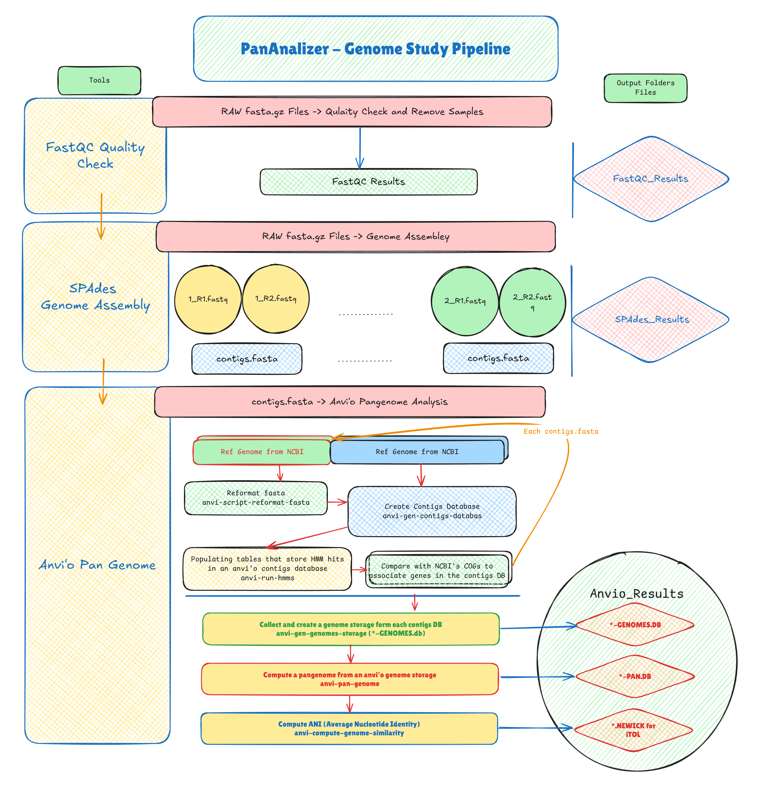

# PanAnalyzer: A Comprehensive Genome Analysis Pipeline

**PanAnalyzer** is a powerful and integrated bioinformatics pipeline designed to streamline the process of genome analysis, moving from raw sequencing data to sophisticated, interactive pangenome visualization. By leveraging a curated set of industry-standard tools—**FastQC**, **SPAdes**, and **Anvio 8**—this pipeline provides an end-to-end solution for researchers in microbial genomics, evolutionary biology, and comparative genomics. The primary goal of PanAnalyzer is to automate the critical steps of quality control, assembly, and pangenome characterization, enabling researchers to efficiently analyze multiple genomes and uncover the core, accessory, and unique gene repertoires of their target species.

### 1. Initial Data Processing and Quality Control

The pipeline's workflow begins with the essential step of quality assessment. All incoming raw sequencing read files (typically in `.fastq` format) are first processed by **FastQC**. This tool generates comprehensive diagnostic reports for each sample, meticulously evaluating key metrics such as per-base quality scores, GC content, sequence duplication levels, and the presence of overrepresented sequences or adapter contamination.

These reports are critical for identifying potential issues with the sequencing data. Informed by the FastQC output, PanAnalyzer then proceeds to a rigorous pre-processing and filtering stage (often using tools like Trimmomatic or fastp) to remove low-quality bases, trim adapters, and filter out reads that do not meet quality thresholds. This refinement is essential for ensuring that only high-quality, reliable data is passed on to the assembly stage, significantly improving the accuracy and contiguity of the resulting genome.

### 2. High-Performance De Novo Genome Assembly

Once the reads are cleaned, the high-quality data is fed into **SPAdes**, a high-performance _de novo_ genome assembler. SPAdes is chosen for its robustness and its sophisticated de Bruijn graph-based algorithms, which are adept at handling various sequencing data types, including Illumina short reads, and are particularly effective for bacterial and archaeal genomes. It carefully navigates repeats and coverage variations to reconstruct the most plausible genomic sequence from the short-read data. The primary output of this stage is a `contigs.fasta` file for each sample, which represents the draft genome assembly for that organism.

### 3. Pangenome Construction and Visualization

With the draft genomes assembled, PanAnalyzer transitions from single-genome reconstruction to multi-genome comparative analysis using the **Anvio 8** platform. This is the core of the pangenome analysis.

First, each assembled `contigs.fasta` file is converted into an Anvio-specific contigs database. During this process, Anvio identifies open reading frames (ORFs), annotates genes using functions like NCBI COGs (Clusters of Orthologous Groups), and identifies ribosomal RNAs and key single-copy core genes.

Once all genomes are processed, the `anvi-pan-genome` workflow is executed. This powerful command clusters all identified genes from all input genomes to build a comprehensive pangenome database. It systematically identifies the **core genome** (gene clusters present in all strains), the **accessory genome** (gene clusters present in some strains), and **unique genes** (specific to a single strain).

The true power of PanAnalyzer is realized in the final visualization. Anvio's interactive display allows researchers to visually explore the entire pangenome, integrating genome structure, gene cluster presence/absence, functional annotations, and phylogenetic relationships into a single, dynamic and publication-quality interface. This enables the intuitive discovery of genomic islands, functional differentiators between strains, and the core evolutionary history of the species.

## The Pipeline Diagram



## Environment Setup

### Conda Setup (Optional)

Below are the steps to set up using Conda environment manager on Linux (Debian based). Skip if you already have Conda installed in your system.

```bash
# Create a folder in the user's home directory.
mkdir -p ~/miniconda3

# Download Mini Conda (Mini Conda is a reduced package and helps you to save disk space.)
wget https://repo.anaconda.com/miniconda/Miniconda3-latest-Linux-x86_64.sh -O ~/miniconda3/miniconda.sh

# Setup Conda
bash ~/miniconda3/miniconda.sh -b -u -p ~/miniconda3

# Remove setup files.
rm ~/miniconda3/miniconda.sh

# Add conda path to the .bashrc file.
nano ~/.bashrc # Insert at bottom of the file -> export PATH="~/miniconda3/condabin:$PATH"

# Close terminal and re-open a new terminal to refresh.
# Initialize Conda
conda init
```

### Conda Environment Setup

First check the Conda version and run an update. This command will update the Conda environment if updates are available.

```bash
conda --version  # -> conda 23.7.4

# Update Conda if needed
conda update conda
```

You need to create a new Conda environment for the PanAnalyzer pipeline. I named the Conda environment "GEM".

```bash
# Create new Conda environment called "GEM"
conda create -n GEM python=3.10

# Activate the newly created Conda environment.
conda activate GEM

# Upgrade PIP in the environment if needed.
python -m pip install --upgrade pip
```

If you need to remove the environment.

```bash
# Deactivate Conda environment -> (GEM) user_name@pc_name$ _ to (base) user_name@pc_name$ _ or user_name@pc_name$ _.
conda deactivate

# In case you need to delete the environment. (For recreation if something is not working)
conda env remove -n GEM
```

### Install Anvio

Please select the Linux setup instructions. You can directly install Anvio-8 from the below command. Please check the updated command is available in [Anvio's website](https://anvio.org/install/linux/stable/) for version compatibility.

```bash
# Activate Conda environment (Previously created)
conda activate GEM  # If Conda environment already not activated.

# Setup required packages
conda install -y -c conda-forge -c bioconda python=3.10 \
    sqlite=3.46 prodigal idba mcl muscle=3.8.1551 famsa hmmer diamond \
    blast megahit spades bowtie2 bwa graphviz "samtools>=1.9" \
    trimal iqtree trnascan-se fasttree vmatch r-base r-tidyverse \
    r-optparse r-stringi r-magrittr bioconductor-qvalue meme ghostscript \
    nodejs=20.12.2

# Download pre-compiled binaries of Anvio package from GitHub.
curl -L https://github.com/merenlab/anvio/releases/download/v8/anvio-8.tar.gz --output anvio-8.tar.gz

# Setup downloaded package using PIP.
pip install anvio-8.tar.gz

# Remove downloaded setup file
rm anvio-8.tar.gz
```

NOTE: Please check Anvio's website for updated installation instructions.

### Install FastQC

FastQC aims to provide a simple way to do some quality control checks on raw sequence data coming from high throughput sequencing pipelines.

```bash
# Activate Conda environment
conda activate GEM  # If Conda environment is not already activated.

# Install FastQC from BioConda channel
conda install -c bioconda fastqc

# Install MultiQC for combining FastQC reports using PIP.
pip install multiqc
```

### Setup Anvio Environment

Before running anything, you need to set up the required genome reference databases in the Conda environment.

```bash
# Anvio's ANI process needs a lower version of matplotlib at the time of writing.
pip install matplotlib==3.7.3

# Setup NCBI COGs databases.
anvi-setup-ncbi-cogs --num-threads 8
   #COG version ..................................: COG20
   #COG data source ..............................: The anvi'o default.
   #COG base directory ...........................: /home/gayan/miniconda3/envs/GEM/lib/python3.10/site-packages/anvio/data/misc/COG
   #...

# Download information from GTDB (gtdb.ecogenomic.org).
anvi-setup-scg-taxonomy --num-threads 8
```

### Setup SPAdes

You can install SPAdes for genome assembly python application to the current activated Conda environment.

```bash
# Activate Conda environment
conda activate GEM  # If Conda environment is not already activated.

# Install SPAdes from BioConda channel
conda install -c bioconda spades

# Test SPAdes installation
spades.py --help
spades.py --test --careful && rm -rf spades_test
```

## PanAnalyzer Options

Below are the PanAnalyzer options.

```py
# Path to Conda installation
CONDA_PATH = os.path.expanduser("~/miniconda3/bin/conda")

# Your Conda environment name
CONDA_ENV = "GEM"

# Sample selection used in the study (See the sample in the project and use as a template)
SAMPLES_PREFIX = "Study-All.csv"  # Name of the study file
# GenBank reference file extensions
REFERENCE_FILE_EXTENSION = ".fna"

TEMP_OUTPUT = "./OUTPUT/TEMP"

SPADES_OUTPUT = "./OUTPUT/SPAdes_Results"

# Genome samples postfix of forward and reverse reads.
SAMPLE_FORWARD_READS_POSTFIX = "R1_001.trim.fastq.gz"
SAMPLE_REVERSE_READS_POSTFIX = "R2_001.trim.fastq.gz"

# Name of the Project
ANVIO_PROJECT_NAME = "PanAnalyzer"

ANVIO_GENOMES_DB = f"{ANVIO_PROJECT_NAME}-GENOMES.db"
ANVIO_OUTPUT = "./OUTPUT/Anvio_Results"

# What part of the study to run
# You must run the pipeline in this order: FastQC -> SPAdes -> Anvio
# If you need to run the current step with different parameters, you can disable the previous processed pipeline step(s) to avoid re-running the entire pipeline.
PIPE_SPADES = False
PIPE_ANVI_O = False
```

## How To Analyze Results

### Study Preparation

We need to verify the quality before assembly. We use "fastqc" for quality check.

1. Create required folders

   ```bash
   # Quality check
   fastqc --threads 8 --memory 16G NP1_S1_R1_001.trim.fastq.gz NP1_S1_R2_001.trim.fastq.gz
   # Create a summary report using multiqc
   multiqc .
   ```

Look for:

- Per-base quality: most bases > Q30 is ideal.
- Adapter content: should be 0% or near-0%.
- Sequence length distribution: consistent (e.g. 150 bp).
- Paired files: same number of reads (R1 = R2 count).

### How to interpret MultiQC Report:

**Duplicates** = reads with identical sequences appearing multiple times. Can arise from PCR amplification bias or low library complexity. For short-read Illumina data, some duplication (10–20%) is normal, especially with:

- high coverage,
- small genomes,
- targeted sequencing.

**GC (GC content)** = proportion of guanine (G) and cytosine (C) bases in the reads. Different organisms have characteristic GC content. Deviations from expected GC content may indicate contamination or biases in library preparation.

- Each organism has a typical GC% (e.g., E. coli ≈ 50%, Staphylococcus ≈ 33%).
- Large deviations from the expected GC% can hint at:
  - contamination,
  - mixed populations,
  - sequencing artifacts.

**Seqs (Sequences)** = total number of reads in the dataset. High read counts generally improve assembly quality and coverage, but excessively high counts may indicate over-sequencing or PCR duplicates.

- More reads = better coverage and assembly quality. (Generally, aim for millions of reads.)
- Excessively high read counts may indicate over-sequencing or PCR duplicates.
- R1 and R2 counts match — excellent! That means no read-pair loss during trimming.

**FastQC Mean Quality Scores** = average quality score across all bases in the reads. Higher scores indicate better base-calling accuracy. Scores above Q30 are considered high quality.

- Mean quality scores above Q30 are excellent.
- Larger than 30 has ≤ 0.1% error rate and the quality is excellent.
- 20-30 has 0.1-0.3% error rate and the quality is good.
- 20-25 has 0.3-1% error rate and the quality is acceptable.
- < 20 has > 1% error rate and the quality is poor.

**Per sequence quality scores** = distribution of average quality scores across all reads. A normal distribution centered around high scores indicates good overall read quality.

- Q > 30 is excellent.
- Q 20-30 is good.
- Q 10-20 is Bad.

### SPAdes Assemble

SPAdes is a versatile toolkit designed for assembly and analysis of sequencing data. SPAdes is primarily developed for Illumina sequencing data, but can be used for IonTorrent as well. Most of SPAdes pipelines support hybrid mode, i.e. allow using long reads (PacBio and Oxford Nanopore) as a supplementary data.

SPAdes package contains assembly pipelines for isolated and single-cell bacterial, as well as metagenomic and transcriptomic data. Additional modes allow to discover bacterial plasmids and RNA viruses, as well as perform HMM-guided assembly. Besides, SPAdes package includes supplementary tools for efficient k-mer counting and k-mer-based read filtering, assembly graph construction and simplification, sequence-to-graph alignment and metagenomic binning refinement.

#### Assemble with SPAdes Sample

spades.py \
 -1 NP1_S1_R1_001.trim.fastq \
 -2 NP1_S1_R2_001.trim.fastq \
 -o NP1_spades -t 16 -m 64

assembly will be at:
NP1_spades/contigs.fasta

##### Run the spades.sh in the project

Run assembly and analysis of sequencing data of all samples.

```bash
chmod +x spades.sh
./spades.sh
```

### Anvi'o contigs database creation

Make an Anvi'o contigs database  
anvi-gen-contigs-database -f NP1_spades/contigs.fasta -o NP1-contigs.db -n "NP1"

Run HMMs (and optional annotations)
anvi-run-hmms -c NP1-contigs.db

optional extras (pick what you use in your lab):

- anvi-run-kegg-kofams -c NP1-contigs.db
- anvi-run-ncbi-cogs -c NP1-contigs.db

## Analysis Tutorial

[A primer on anvi'o](https://merenlab.org/tutorials/infant-gut/)

[Workshops Installation Tutorials Help An anvi'o workflow for microbial pangenomics](https://merenlab.org/2016/11/08/pangenomics-v2/)

[Vibrio jascida pangenome: a mini workshop](https://merenlab.org/tutorials/vibrio-jasicida-pangenome/)

[Leveling up pangenomics with interactive pangenome graphs](https://anvio.org/tutorials/pangenome-graphs/)

[Single-cell 'Omics with anvi'o](https://anvio.org/tutorials/single-cell-genomics-workshop/)

[An anvi'o tutorial with Trichodesmium genomes](https://anvio.org/tutorials/trichodesmium-tutorial/)

## Credits

### Himani Karunathilake

### Vinura Mannapperuma
